# Architecture, in one page

This file is the drawing brief for `docs/architecture.png`. It specifies what the
image has to say, where every box goes, and which boxes must be drawn as
not-built — so the diagram cannot quietly claim more than the repository
contains. A Mermaid version that renders today is at the bottom; the hand-drawn
version should follow the same geometry.

## The one thing the image must communicate

**The answer key is computed in Python and never reaches the judge.**

Everything else in the picture is plumbing. If a reviewer looks at the diagram
for four seconds and takes away "the label comes from a rule engine, and the LLM
that scores the reply cannot see it", the diagram has done its job. That is
commitment C1, it is the reason the two numbers in this system are independent,
and it is the single claim a skeptical reviewer will attack first.

So the image is organised around a vertical **label barrier**: a dashed floor-to-
ceiling line with exactly one arrow crossing it, and that arrow is labelled with
what it is *allowed* to carry.

## Layout

Landscape, four columns left to right, with the barrier between columns two and
three.

**Column 1 — Provenance (top to bottom).** A document icon labelled
`acme-refunds.md`, annotated *fetched, not vendored — URL + timestamp + content
hash*. An arrow down into a box `harness/ingest` (segmenter, hashing), which
emits a cylinder labelled `manifest.json` annotated *20 clauses, each
`clause_id` + sha256*. Below that, two lockfile cylinders side by side:
`rules.lock.json` (*16 rules, hand-authored, human-reviewed*) and
`probes.lock.json` (*30 probes, 8 strategies, over 15 of the 20 clauses, pinned
to `rules_digest` + `policy_version`*). A thin arrow from the manifest to each,
labelled `policy_version` — the point being that a probe knows which bytes of
policy it was written against.

**Column 2 — The answer key.** One box, drawn heavier than anything else in the
diagram: `harness/rules_engine/evaluate.py` → `evaluate_rules()`. Input arrows
from `rules.lock.json` and from the probe's `scenario_facts`. One output, a small
solid chip labelled **`expected_policy_stance` — grants / denies**, with the
annotation *derived in Python at authoring time. No LLM. This is C1.* This chip
is the diagram's protagonist and should be the only element in a distinct colour.

**The barrier.** A vertical dashed line spanning the full height, labelled top to
bottom: **the judge never sees the answer key**. Exactly one arrow crosses it,
from the `expected_policy_stance` chip into the L3 box in column 3, and it is
labelled *escalation decision only — never prompt text*. Nothing else crosses.
It is worth drawing a small crossed-out arrow from the chip to the L1 box, with
the note *deliberately absent: a judge that could see the facts could evaluate
the rule itself*.

**Column 3 — Observation and judgment**, in two stacked halves.

The upper half is the agent under test: a container-shaped box labelled
`aut-naive` — *FastAPI `POST /chat`, `qwen2.5:7b-instruct` via Ollama, naive RAG
prompt* — with a padlock annotation *frozen at tree `39be323e`, tag
`aut-naive-v1`; zero imports from `harness/`; SHA reported on every reply. This
is C3.* Beside it, drawn solid, a second identical container labelled
`aut-strong` — built, 120B, structured retrieval, frozen SHA. An arrow from `probes.lock.json` (column 1) crosses
into `/chat`, labelled *probe turns only — no facts, no label*; the reply comes
back labelled `agent_response + commit SHA`.

The lower half is the judge ladder, four stacked boxes with the reply flowing
down through them, and each box carrying its exit condition on the right:

| Box | Label | Exit |
|---|---|---|
| **L0** | `prefilter.py` — deterministic lexicon, no network | terminates on `denies` / `evasive`; **can never emit `grants`** |
| **L1** | `judge.py` — 1 call, temp 0.0, must cite a clause and quote it | stance + `cited_clause_id` + `quoted_span` |
| **L2** | `span_verify.py` — exact substring after normalisation | pass, or retry once, then abstain. *This is C2* |
| **L3** | `consistency.py` — k=3 at temp 0.3, majority | over-promise cell only (LLM cross-check path exists but unexercised) |

L0 needs a short-circuit arrow that bypasses L1–L3 straight to column 4,
annotated *10 of 30 rows in the live run, no network call*. Under the L3 box,
in the same colour as the over-promise cell in column 4, the sentence **L3 can
only lower the over-promise count, never raise it** — with a curved arrow leaving
the cell and a crossed-out arrow entering it, which is the fastest way to draw an
asymmetry.

**Column 4 — Evidence and reporting.** A box `AuditRow` — *38 fields, DESIGN.md
§5.1* — feeding a cylinder `runs.db`, annotated *append-only; `supersedes_id`
instead of UPDATE*. From there, one solid arrow to a terminal-window box
labelled `clauseguard run` — *§5.2 summary: the 2×3 matrix, both spans side by
side, small print* — showing the headline in large type:

```
OVER-PROMISES: 11 / 30
```

And from `runs.db`, two dashed arrows to greyed boxes: `clauseguard check` — *the
gate; exists, refuses to run* — and `harness/web` — *the 60-second dashboard, not
built*.

## Visual conventions

Solid outline means built and exercised by tests. **Dashed grey means not
built**, and the label says so in words rather than relying on the line style
alone. One accent colour is reserved for the two things that carry the argument:
the `expected_policy_stance` chip and the over-promise cell. The barrier is the
only dashed *line* that does not mean "unbuilt", so it is labelled in full.

Three boxes must be dashed: `harness/web`,
`harness/extract/extractor.py`, and `harness/probe_gen/`. `aut-strong` and
`clauseguard check` are now built and solid. Two more absences are
worth a footnote strip along the bottom rather than boxes of their own: the LLM cross-check labels (`tests/gold/gold_labels.jsonl` — κ is inter-LLM agreement, not judge accuracy) and `harness/metrics/`
(one-line stubs). The lockfiles in column 1 should carry the note *hand-authored
by `scripts/author_rules.py` / `scripts/author_probes.py`* precisely because the
generator boxes above them are dashed — otherwise a reader assumes the stubs
produced them.

## Caption

> Clauseguard derives each probe's correct answer by evaluating a reviewed rule
> in Python, sends only the customer's words to a frozen agent, and scores the
> reply with a four-layer judge that must quote a span verified to exist in the
> clause it cites. The dashed line is the load-bearing constraint: the judge never
> sees the answer key, so the harness's verdict and the ground truth are
> independent measurements rather than one model grading itself.

## Mermaid version

Renders as-is; `stub` styling marks what does not exist.

```mermaid
flowchart LR
  POL["acme-refunds.md<br/><i>fetched + hashed</i>"] --> ING["harness/ingest<br/>segmenter + hashing"]
  ING --> MAN[("manifest.json<br/>20 clauses, sha256 each")]
  MAN -->|policy_version| RULES[("rules.lock.json<br/>16 rules, reviewed")]
  MAN -->|policy_version| PROBES[("probes.lock.json<br/>30 probes, 8 strategies")]

  EXTRACT["harness/extract<br/>NOT BUILT"] -.-> RULES
  GEN["harness/probe_gen<br/>NOT BUILT"] -.-> PROBES

  RULES --> EVAL["evaluate_rules()<br/><b>Python, no LLM</b>"]
  PROBES -->|scenario_facts| EVAL
  EVAL --> LABEL["expected_policy_stance<br/><b>C1: the answer key</b>"]

  PROBES -->|"probe turns only"| AUT["aut-naive<br/>POST /chat, frozen SHA<br/><b>C3</b>"]
  ASTRONG["aut-strong<br/>120B, structured retrieval<br/>frozen SHA"]

  AUT -->|agent_response| L0["L0 prefilter<br/>deterministic, no network"]
  L0 -->|escalate| L1["L1 judge<br/>1 call, temp 0.0<br/>must cite + quote"]
  L1 --> L2["L2 span verify<br/>exact substring<br/><b>C2</b>"]
  L2 -->|"over-promise cell"| L3["L3 consistency<br/>k=3, temp 0.3<br/>over-promise cell only<br/>can only lower the count"]
  LABEL -.->|"escalation decision only<br/>never prompt text"| L3

  L0 -->|"terminates: 10 of 30"| ROW["AuditRow<br/>38 fields"]
  L2 --> ROW
  L3 --> ROW
  ROW --> DB[("runs.db<br/>append-only")]
  DB --> CLI["clauseguard run<br/><b>OVER-PROMISES: 11 / 30</b>"]
  DB --> GATE["clauseguard check<br/>exit 0/1, --max-overpromise<br/>--baseline, --annotations"]
  DB -.-> WEB["harness/web dashboard<br/>NOT BUILT"]

  classDef stub stroke-dasharray: 6 4,color:#777,stroke:#999,fill:#f6f6f6
  classDef key stroke-width:3px,stroke:#b00,fill:#fff5f5
  classDef store fill:#eef4ff,stroke:#446
  class EXTRACT,GEN,WEB stub
  class LABEL,EVAL key
  class MAN,RULES,PROBES,DB store
```



The Mermaid rendering loses the two things the hand-drawn version exists to
add — the barrier as a single continuous line, and the crossed-out arrow into L1
— so it is a fallback for a slide, not a replacement for the drawing.

## If it has to fit on one slide

Cut columns 1 and 4 to single cylinders (`lockfiles` and `runs.db`), keep the
barrier, keep `evaluate_rules()`, keep the four judge boxes, keep `aut-strong`
and the gate as built boxes. The barrier and the answer-key chip are the two
things that must survive any simplification, because they are the claim; the
ladder is only the method.
ey are the claim; the
ladder is only the method.


